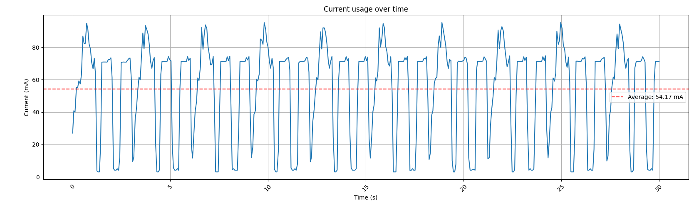
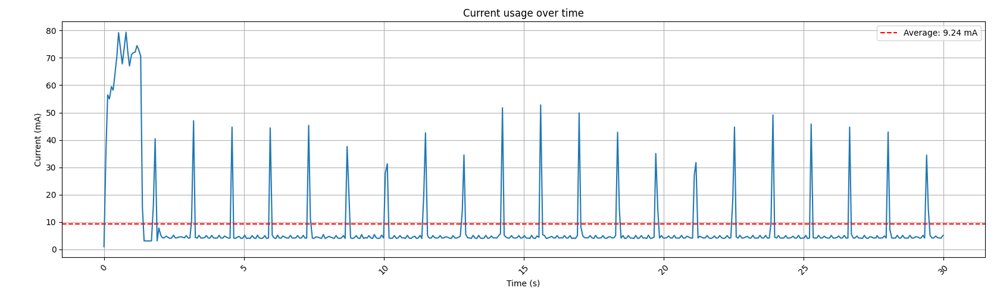
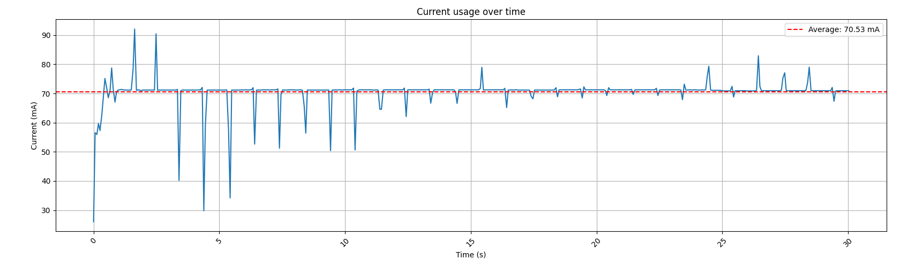
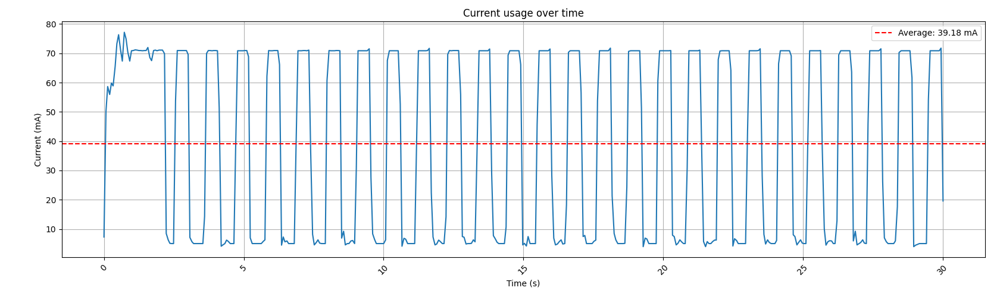
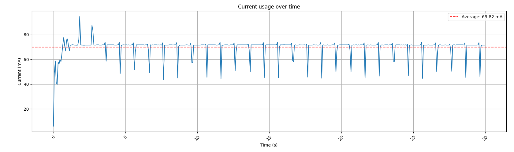
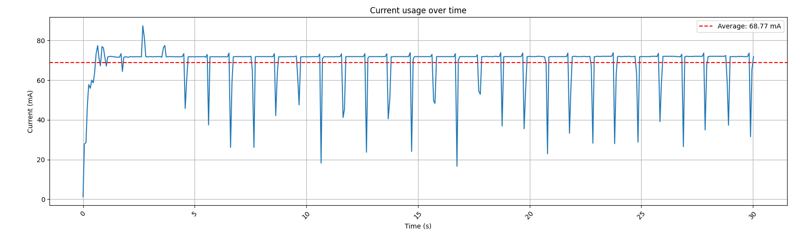
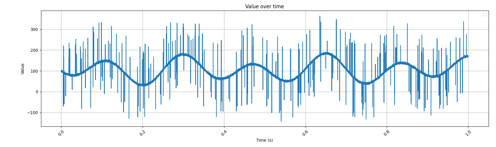
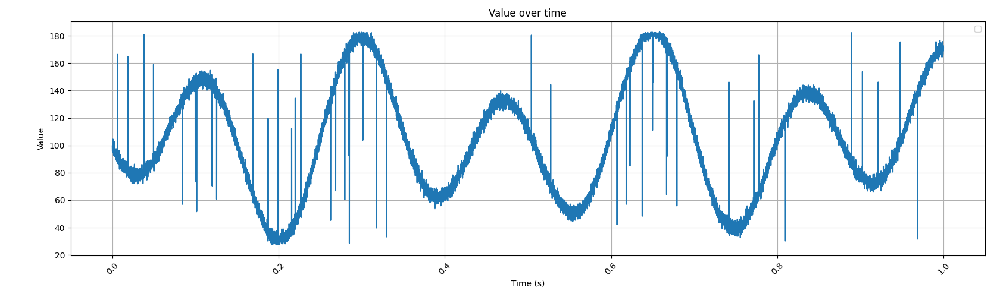
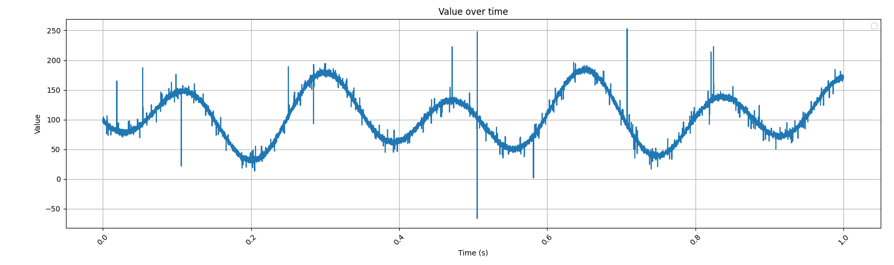
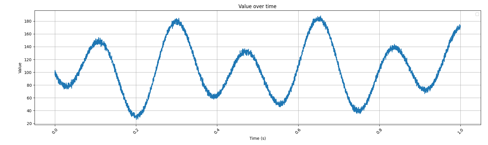

# IoT Individual Project

This project is a prototype implementation of a full system to harness an embedded device (an ESP32 board) to analyze incoming high-frequency signals, both by aggregating collected samples into average measurements and transmitting them for further analysis, and by estimating their maximum frequency in order to adapt the sample rate accordingly in order to save power and communication overhead.

All code is written in a subset of C++ suitable for embedded devices (which means for example that exceptions are unavailable, on top of very tight time and memory constraints).

The code makes extensive use of [ESP-IDF](https://github.com/espressif/esp-idf), Espressif's ESP32 SDK, including FreeRTOS tasks scheduled on multiple cores, queues and task notifications.

In addition to the SDK, some external libraries are used:
- [ArduinoFFT](https://github.com/kosme/arduinoFFT) is used in its non-Arduino mode for its relatively optimized FFT and windowing function implementations
- [esp-mqtt](https://github.com/espressif/esp-mqtt), by Espressif, is used for MQTT functionality
- A custom ESP-IDF port of [MCCI Catena's LMIC](https://github.com/mcci-catena/arduino-lorawan) library is used for LoRaWAN functionality
- Espressif's `example_connect` function, from `protocol_examples_common`, is used for Wi-Fi configuration directly through the ESP-IDF configuration menu

## Maximum Sampling Frequnecy

The ESP32-S3's ADC is surprisingly fast, allowing for a sample rate of up to 83.333 kHz; however, such a frequency can't be fully used by the program as it has to do additional, slower processing.

The program's actual maximum sample rate was manually measured sampling from the ADC with a 128-sample tumbling window average, a 9-sample Hampel filter for noise and a 16384-sample window to be around ~48 kHz; after this, while the ADC could keep up, the FFT calculations started taking too long and slowing down the program (note however that performance could greatly vary by changing the mentioned settings).

The maximum sample rate for the final program was actually chosen to be even lower than 48 kHz, at 16.384 kHz, because of a technical limitation: the minimum detectable frequency by running a FFT calculation is `sample_rate_hz / window_size`, but the maximum window size allowed by the FFT library is 16384 samples. For this reason, being able to process lower frequencies, down to 1 Hz, was prioritized over a high sample rate, resulting in the 16.384 kHz value.

## Optimal Sampling Frequency

In order to reduce power consumption, the aforementioned FFT algorithm is run on a 16384-sample window, enabling the identification of frequencies in the 1 Hz-8.192 kHz range.

The samples are first run through DC offset removal (they're offset to make their average value null), then processed through a Hann windowing function to minimize spectral leakage, and finally run through the FFT algorithm.

The FFT's results are then converted from complex numbers to their magnitudes, and a peak detection algorithm is run in order to identify the highest peak and thus a possible band limit for the signal.

According to the [Nyquist-Shannon sampling theorem](https://en.wikipedia.org/wiki/Nyquist%E2%80%93Shannon_sampling_theorem), a bandlimited signal can be discretized and then reconstructed without aliasing as long as the sampling rate for discretization is strictly greater than twice the original signal's highest frequency:

$$f_s > 2B$$

For this reason, the new sampling frequency used in the program is twice the highest peak's frequency, plus an offset of 0.1 Hz in order to satisfy the strict inequality.

Once the sampling frequency is adjusted, the program continues running all calculations, including FFT ones, using the new sample rate and window size.

## Aggregate Function Computation

Separately from the sampling frequency computations, incoming samples are run through an aggregation function, currently corresponding to a data-driven aggregation into an average calculated on either 128-sample tumbling windows or 128-sample sliding windows.

## Communication through MQTT/LoRaWAN

After being packed into a shorter format, the aggregation results can be transmitted to a server through two channels:
- MQTT over Wi-Fi, usually transmitting to a nearby edge server: provides relatively fast transmission, and uses full TLS and two-way verification between the client and the MQTT broker
- LoRaWAN, usually transmitting to the cloud: much slower than MQTT but provides long-range communication; aggregation has to be tweaked heavily from the default of 128-sample tumbling windows to transmit all data while staying below the 0.1% duty cycle demanded by TTN

## Input Signals

Multiple input signals have been evaluated, with the first three being clean sums of sinusoids and the last one being injected with random noise:
- A: $f(t)=2\sin(2\pi\dot{}3.2t)+2\sin(2\pi\dot{}5.6t)$
- B: $f(t)=4\sin(2\pi\dot{}100t)+3\sin(2\pi\dot{}1000t)+2\sin(2\pi\dot{}2000t)+5\sin(2\pi\dot{}4000t)$
- C: $f(t)=3\sin(2\pi\dot{}0.5t)+2\sin(2\pi\dot{}1t)+5\sin(2\pi\dot{}4999t)+3\sin(2\pi\dot{}8100t)$
- D: $f(t)=2\sin(2\pi\dot{}3.2t)+2\sin(2\pi\dot{}5.6t)+n(t)+A(t)$, with n(t) being low-amplitude Gaussian noise and A(t) being random high-amplitude spikes of either sign ($n(t) = N(0, 0.04)$ and $A(t) = Bern(0.02)\dot{}(2\dot{}Bern(0.5) - 1)\dot{}U(5, 15)$)

In order to handle the noise, either a Z-Score filter or a 9-sample Hampel filter can be run on the samples in order to identify and replace outliers.

## Performance Evaluation

### Energy Savings and Packet Size through Sample Rate Optimization

In order to evaluate the signal analyzer's power usage, a second program has been created to interface with an INA219 current and voltage sensor. Since the author didn't have a second ESP32 device available, this program was instead adapted to run on an AVR microcontroller.

Unless noted otherwise, the below measurements are taken while running the analysis program on a Heltec LoRa 32 v3 and build over a default configuration of:
- Dummy signal generation (a DAC wasn't available)
- 128-sample tumbling window average
- 9-sample Hampel filter
- LoRaWAN enabled and not connected (disconnected LoRaWAN has almost no impact on power draw, while MQTT over Wi-Fi draws a lot of power and renders all measurements identical)

First of all, savings were compared for signal A, with a maximum frequency of 5.6 Hz:

| Unoptimized | Optimized |
| ----------- | --------- |
|  |  |

As can be seen, the very low frequency of the signal allows the microcontroller to only wake from sleep very rarely, reducing its average current draw over its first 30 seconds from 54.17 mA to 9.24 mA (trending down after the initial spike).

Due to the requirement for the window size to be a power of two and at least 9 samples big, while the sampling rate is adjusted to 11.2 Hz, the FFT window size is set to 16 samples, resulting in a ~1.42-second delay between each sample processing step.

Because of the aggregation window size being fixed at 128 samples regardless of the sample rate, this also results in a reduction in network traffic from 128 values/s (1 packet with 128 values every second, resulting in 524 B sent every second) to 0.0875 values/s (1 packet with a single value every ~11.4 seconds, resulting in 16 B sent every 11.4 seconds).

A different situation can be seen for signal B, with a maximum frequency of 4000 Hz, and signal C, with a maximum frequency of 8100 Hz. Note that in these two cases, the original Hampel filter was disabled due to the signals' high-frequency components otherwise being smoothed out; the FreeRTOS tick rate also had to be modified back to its default of 100 due to currently unsolved issues inside ESP-IDF's automatic sleeping code.

Signal B (unoptimized vs optimized):

| Signal | Unoptimized | Optimized |
| ------ | ----------- | --------- |
| B |  |  |
| C |  |  |

As shown, the optimization shows diminishing return the closer the signal's highest frequency gets to the Nyquist frequency of 8.192 kHz (relative to a 16.384 kHz sampling rate): for signal B, the decrease in current draw is only of 31.35 mA (from 70.53 mA to 39.18 mA), while for signal C it's very low at 1.05 mA (from 69.82 mA to 68.77 mA).

Memory usage, regardless of the optimal sample rate, is mostly composed by:
- 512 B of ADC sample memory (128 samples * 4 B/sample for adc_continuous_data_t)
- 1 KiB for ADC DMA buffers (256 samples * 4 B/sample)
- 128 KiB of float sample memory (((16384 + 8) samples * 4 B/sample) * double buffer)
- 64 KiB of additional FFT processing memory (16384 floats for complex parts)

This can however potentially be lowered by dynamically reallocating buffers with a smaller size after the sample rate is adjusted.

### Noisy Signals

In contrast to the 3 previous signals, signal D incorporates random noise: its n(t) Gaussian noise component models sensor baseline noise, while its A(t) anomaly injection component simulates transient hardware faults and disturbances.

From the point of view of the analyzer, the high-frequency baseline noise can only be mitigated through a relatively aggressive sliding window filter (like a hampel filter), or more simply by rejecting high-frequency but low-amplitude peaks in the FFT when there are other peaks present with higher amplitudes. Anomalies, however, necessarily have to be handled with specialized noise filters, of which a Z-score filter, either based on a global average or on a sliding window average, and a Hampel filter have been evaluated.

In general, the unwindowed Z-score filter, run on the full FFT input, worked well at detecting and replacing anomaly spikes that went outside the bounds of normal signals but didn't eliminate lower-amplitude spikes or spikes where the resulting sample was anomalous compared to its surroundings but still within the normal bounds of the overall signal.

Windowed filters, such as a windowed Z-score filter and a hampel filter, performed almost perfectly at detecting and replacing anomalies and sparing normal data, although the baseline noise remained. However, it must be noted that they add a latency equal to their window size - 1, divided by the sample rate; since a 9-sample window was used at 16384 Hz, this resulted in a 0.5 ms delay.

| Filter | Values |
| ------ | ------ |
| Raw    |  |
| Z-score |  |
| Z-score windowed |  |
| Hampel |  |

### Latency

End-to-end transmission latency was measured over MQTT with the following configuration:
- Dummy signal generation (a DAC wasn't available) for signal A
- 128-sample tumbling window average
- 9-sample Hampel filter
- No sample rate optimization (fixed at 16.384 kHz, 16384-sample window)

In order to collect timestamp information from both the ESP32 and the MQTT subscriber, the `mqtt-sub` program was run with the `--timestamps` argument specified, while the ESP32 was monitored using the command `idf.py monitor --timestamps --timestamp-format '%H:%M:%S.%f'`, obtaining the following logs.

ESP32:
```
10:30:19.274985 I (5601) main: Collecting done for buffer 1
10:30:19.277935 I (5601) main: Processing buffer 1
10:30:19.282810 I (5601) FFT: Window size: 16384, sample rate: 16384.000000 Hz
10:30:19.320548 I (5641) FFT: Average output size: 128
10:30:19.385543 I (5711) FFT: FFT avg: 153.817810, max: 185088.375000
10:30:19.393766 I (5711) FFT: Peak found around 6: (5, 124800.062500) (6, 155316.312500) (7, 41588.671875)
10:30:19.399515 I (5711) FFT: Parabola: (-72121.945312)x^2 + (823857.687500)x + ...
10:30:19.402545 I (5711) FFT: Last peak: 5.711560 Hz
10:30:19.406550 I (5721) FFT: Optimal sample rate: 11.523121 Hz
10:30:19.412605 I (5721) main: Sending aggregation results to publisher thread
10:30:19.416545 I (5731) main: Processing done for buffer 1
10:30:19.424552 I (5731) MQTT: Sending 128 aggregate values (512 B, 0.007812 s per value) at 5.340000 s
10:30:19.481631 I (5801) MQTT: MQTT_EVENT_PUBLISHED, msg_id=60144
```

`mqtt-sub`:
```
10:30:19.466894: topic/aggregate: 5.34 s, 128 values (1 value per 7.81 ms), [112.74, 108.89, 106.09, 104.55, 104.35, 105.45, 107.67, 110.71, 114.21, 117.74, 120.84, 123.08, 124.09, 123.59, 121.39, 117.48, 111.96, 105.07, 97.18, 88.76, 80.35, 72.51, 65.80, 60.72, 57.68, 56.98, 58.75, 63.00, 69.55, 78.07, 88.11, 99.12, 110.47, 121.52, 131.64, 140.29, 146.98, 151.40, 153.36, 152.83, 149.94, 144.99, 138.38, 130.60, 122.21, 113.78, 105.83, 98.86, 93.23, 89.20, 86.89, 86.27, 87.18, 89.34, 92.40, 95.91, 99.43, 102.52, 104.80, 105.99, 105.88, 104.44, 101.72, 97.93, 93.40, 88.51, 83.74, 79.57, 76.45, 74.78, 74.88, 76.94, 81.01, 86.99, 94.64, 103.59, 113.34, 123.34, 132.99, 141.68, 148.85, 154.04, 156.89, 157.18, 154.86, 150.05, 143.01, 134.14, 123.97, 113.09, 102.13, 91.72, 82.43, 74.76, 69.07, 65.58, 64.38, 65.39, 68.38, 73.00, 78.81, 85.31, 91.97, 98.30, 103.86, 108.27, 111.32, 112.90, 113.02, 111.85, 109.67, 106.83, 103.76, 100.89, 98.65, 97.40, 97.42, 98.89, 101.84, 106.17, 111.65, 117.94, 124.60, 131.13, 137.00, 141.72, 144.84, 145.99]
```

From the printed timestamps, it can be seen that:
- Relative to the time collection finished, it took ~132 ms for the 16384-sample window to be fully processed
- It further took ~18 ms for the aggregated data to be sent and received by MQTT thread, which started transmitting it on the network
- It took ~42 ms for the data to be fully transmitted and received by the MQTT subscriber (not accounting for eventual delays given by the ESP32 monitor)
- ~15 ms later, the ESP32 received an acknowledgement from the broker that the packet was correctly received

In addition to this, it must be considered that samples had been undergoing collection for one second ($\frac{16384}{16384\,\text{Hz}} = 1\,\text{s}$) prior to that.

For this reason, the maximum latency between data collection and the data being received by a MQTT subscriber in this test environment can be estimated to be at least ~1.192 s, not including packet acknowledgement, of which 42 ms are given by network latency, 150 ms are given by internal processing and 1 s is given by buffering.

Since the program is calibrated to always have a window size greater than the sample rate in Hz, it's not normally possible to go below 1 s of data collection latency. However, the other values can change, for example by using sample rate optimization and lowering the aggregation window size to match:

```
10:47:00.060579 I (6921) main: Collecting done for buffer 0
10:47:00.063630 I (6921) main: Processing buffer 0
10:47:00.068816 I (6931) FFT: Window size: 16, sample rate: 11.685245 Hz
10:47:00.071603 I (6931) FFT: Average output size: 1
10:47:00.076679 I (6941) FFT: FFT avg: 30.049286, max: 64.166557
10:47:00.078686 I (6941) FFT: Peak found at 8
10:47:00.082628 I (6941) FFT: Last peak: 5.842622 Hz
10:47:00.086599 I (6951) FFT: Optimal sample rate: 11.785245 Hz
10:47:00.092540 I (6951) main: Sending aggregation results to publisher thread
10:47:00.095636 I (6961) main: Processing done for buffer 0
10:47:00.103617 I (6961) MQTT: Sending 1 aggregate values (4 B, 1.369248 s per value) at 6.570000 s
10:47:00.165500 I (7181) MQTT: MQTT_EVENT_PUBLISHED, msg_id=53337
```
877644 - 815761
856420 - 815761

```
10:47:00.144276: topic/aggregate: 6.57 s, 1 values (1 value per 1369.25 ms), [105.08]
```

In this case, the latency was changed to 1.369 s for data collection (higher), but only 43 ms for processing; subscriber reception took ~41 ms, and the acknowledgement took 21 further ms, adding up to a total maximum latency 1.453 s.

# Building the project

The ESP32 part of the project can be built using a standard ESP-IDF 6.0 toolchain, making sure to customize the project's build options as outlined in [Build Configuration](#build-configuration).

The AVR part of the project requires avr-gcc and avrdude for building and flashing to a physical device.

The minimal physical equipment to run the project is limited to:
- One AVR development board (tested on an ATmega 2560)
- One ESP32 development board (tested ona Heltec LoRa 32 v3)
- A USB-C cable
- Two 4.7 kΩ resistors (needed for I2C)
- Jumper cables

In order to communicate over MQTT, a Wi-Fi AP is required, while for LoRaWAN the ESP32 board needs to equipped with a LoRa antenna, and a nearby LoRaWAN gateway is required.

## MQTT

To connect to MQTT, the project expects 3 files containing cryptographic data to be found in `source/analyzer/mqtt_certs`, which have not been provided:
- `broker.crt`: the MQTT broker's certificate
- `client.crt` and `client.key`: the client's identifying certificate and associated private key, used for two-way authentication

These files can be generated by using the following tools provided in `utils`:
- `create-broker-crt`: creates a self-signed certificate for a self-hosted broker
- `create-csr`: creates a private key and certificate signing request for a client (this can be signed with the above self-hosted broker certificate or sent to a chosen broker for signing, for example test.mosquitto.org)
- `sign-csr`: signs a client's CSR with the provided broker certificate, providing a client certificate

For a self-hosted flow, it's enough to run the following commands to get a fully working setup, making sure to enter the broker's and client's local IPs as their certificates' common names:

```sh
mkdir -p source/analyzer/mqtt_certs
cd source/analyzer/mqtt_certs
python3 ../../../utils/create-broker-crt
python3 ../../../utils/create-csr
python3 ../../../utils/sign-csr
```

As for the actual MQTT broker, one can be hosted by installing [Mosquitto](https://mosquitto.org/): in this case, a sample configuration file is already provided at `source/analyzer/mosquitto.conf`, making starting a Mosquitto broker as simple as `cd source/analyzer && mosquitto -c mosquitto.conf`.

In order to read MQTT samples from a self-hosted broker, a program is provided in `utils/mqtt-sub` that subscribes to `topic/aggregate` on the just configured local MQTT broker, decodes the packed data and displays it:

```
topic/aggregate: 4.75 s, 128 values (1 value per 7.81 ms), [103.13, 108.63, 110.69, 112.68, 115.24, 117.65, 119.52, 121.73, 124.28, 126.30, 128.08, 130.39, 132.61, 134.22, 136.02, 138.22, 139.95, 141.32, 143.19, 145.09, 146.36, 147.73, 149.55, 150.97, 151.94, 153.34, 154.85, 155.71, 156.52, 157.80, 158.73, 159.11, 159.84, 160.76, 161.06, 161.20, 161.83, 162.25, 162.09, 162.20, 162.63, 162.49, 162.10, 162.21, 162.20, 161.56, 161.10, 161.01, 160.40, 159.44, 158.93, 158.44, 157.31, 156.27, 155.69, 154.73, 153.34, 152.42, 151.65, 150.28, 148.92, 148.08, 146.97, 145.36, 144.15, 143.19, 141.67, 140.03, 138.95, 137.70, 135.92, 134.48, 133.43, 131.89, 130.18, 129.05, 127.92, 126.25, 124.87, 123.96, 122.65, 121.07, 120.06, 119.14, 117.66, 116.36, 115.59, 114.50, 113.06, 112.16, 111.48, 110.29, 109.18, 108.68, 107.99, 106.90, 106.29, 106.03, 105.28, 104.50, 104.33, 104.05, 103.30, 102.92, 102.96, 102.53, 101.96, 102.00, 102.04, 101.57, 101.41, 101.74, 101.70, 101.42, 101.72, 102.14, 102.03, 102.08, 102.67, 102.93, 102.83, 103.22, 103.80, 103.82, 103.87, 104.48, 104.85, 104.77]
```

## LoRaWAN

The application expects three LoRaWAN keys in `source/analyzer/lora_keys`, used for OTAA (Over-the-Air Activation):
- `app_eui.key`: 8 bytes, can be all zeros
- `app_key.key`: 8 bytes, given by the gateway
- `dev_eui.key`: 16 bytes, given by the gateway

All keys are expected to be written in "C array element" format, i.e. `0x00, 0x00, 0x00, 0x00, 0x00, 0x00, 0x00, 0x00` for `app_eui.key`.

The easiest way to obtain these keys is to register the device on The Things Network, which will automatically generate random app key and dev EUI values and register the device on TTN gateways.

## Build Configuration

The project can be fully configured with ESP-IDF's builtin configuration filter by running `idf.py menuconfig`.

### Main settings (required)
- Set `Main Configuration > Device` depending on your ESP32 model (right now the only supported devices are Heltec LoRa 32 v2 and v3)
- Adjust the other options in `Main Configuration` (FFT filter, aggregation, whether to use MQTT or LoRaWAN, ...) depending on the kind of test being run

### Other general settings (required)
- Set `Component config > FreeRTOS > Kernel > configTICK_RATE_HZ` to `1000`
- Enable `Component config > ESP Timer (High Resolution Timer) > Support ISR dispatch method`
- Enable `Component config > Power Management > Support for power management`
- Enable `Component config > FreeRTOS > Kernel > configUSE_TICKLESS_IDLE`

### Wi-Fi settings (required for MQTT)
- Set `Example Connection Configuration > WiFi SSID` to your Wi-Fi SSID
- Set `Example Connection Configuration > WiFi Password` to your Wi-Fi password

### LMIC settings (required for LMIC)
- Select your region in `Component config > LMIC Configuration > Region` (for example, `EU868`)
- Select your radio model in `Component config > LMIC Configuration > Radio` (`SX1262` for Heltec LoRa v3)

### Optimization settings (optional)
- Set `Compiler options > Optimization Level` to `Optimize for size (-Os with GCC, -Oz with Clang)`
- Set `Compiler options > Assertion level` to `Silent (saves code size)`
